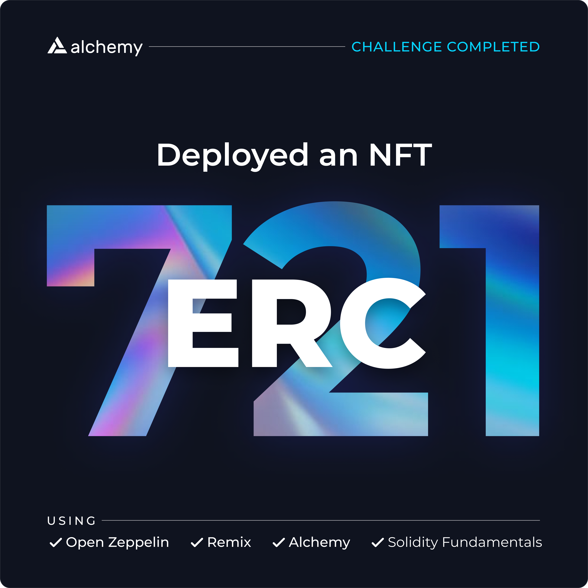

## Week 1 ##
[How to Develop an NFT Smart Contract (ERC721) with Alchemy](https://docs.alchemy.com/alchemy/road-to-web3/weekly-learning-challenges/1.-how-to-develop-an-nft-smart-contract-erc721-with-alchemy)

Files used:
- **ERC721.png**
  
    https://ipfs.filebase.io/ipfs/QmWz8B18cJHfPejCPHjho911jPCDB9mdSVLg8fFnivQiNP
    

- **metadata.json**
  
    [ipfs://QmNQx25WBN7o8jdiSCK6xFVs65paZUWjdbyiK1bx5b8BTA](ipfs://QmNQx25WBN7o8jdiSCK6xFVs65paZUWjdbyiK1bx5b8BTA)

---
### Contract Address (Testnet) ###
- Rinkeby: [0x8f66C05121aBf4Ea83Ba0348d537A46e2da925B4](https://rinkeby.etherscan.io/address/0x8f66C05121aBf4Ea83Ba0348d537A46e2da925B4)
- Goerli: [0x8f66C05121aBf4Ea83Ba0348d537A46e2da925B4](https://goerli.etherscan.io/address/0x8f66c05121abf4ea83ba0348d537a46e2da925b4)

**1º NFT minted:**
[OpenSea](https://testnets.opensea.io/assets/rinkeby/0x8f66c05121abf4ea83ba0348d537a46e2da925b4/0)
